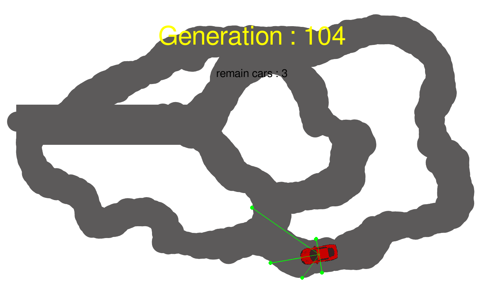

# :snake: Python A.I that drives

## :rocket: Description:

A Python program using <a href="https://neat-python.readthedocs.io/en/latest/">Neat-Python</a> and <a href="https://www.pygame.org/news">PyGame</a> that learn to drive

## :ok_hand: Requirements:

- Python 3.5 or above
- PyGame 2
- Neat-Python

## :fire: Usage:

- Clone this repository using: `git clone https://github.com/Trecto34/drive-ai`
- Install the Requirements using: `pip install -r requirements.txt`
- Run `python main.py`

## :pencil: Note:

This is the most fun thing I've programmed so far, I love Artificial Intelligence so much and implementing it into a game is so amazing to me, I even managed to learn a little bit about PyGame in the process.
I am thinking of doing something similar only in a Flappy Bird replica, but who knows?

## Credits:

The basis of the project was taken from this <a href="hhttps://github.com/monokim/framework_tutorial/tree/master/neat">repository</a>!
